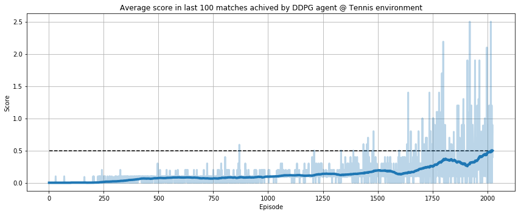

# Project 3: Tennis

### Introduction

For this project, I have trained an agent for solving a continous control problem: play table tennis against another agent (same policy) to maximize the number of times the agents hit and pass the ball over the net.


In this environment, two agents control rackets to bounce a ball over a net. If an agent hits the ball over the net, it receives a reward of +0.1. If an agent lets a ball hit the ground or hits the ball out of bounds, it receives a reward of -0.01. Thus, the goal of each agent is to keep the ball in play.

The observation space consists of 8 variables corresponding to the position and velocity of the ball and racket. Each agent receives its own, local observation. Two continuous actions are available, corresponding to movement toward (or away from) the net, and jumping.

The task is episodic, and in order to solve the environment, **the agents must get an average score of +0.5** (over 100 consecutive episodes, after taking the maximum over both agents).

I have **solved the environment in 2 different ways**:

 - Using a **single DDPG** agent trained with samples from both "players". So at every step I add two samples to the replay buffer (one from the red player and one from the blue one).
 
 - Using a **MADDPG** once again training the agent with samples from both players, but with an "omniscient" critic. Getting more stable results.

### Installation and execution

I have used Linux. You can download the version for your SO, but remember to point to your Tennis environment folder:

```env = UnityEnvironment(file_name="Tennis_Linux/Tennis.x86_64")```

Installation steps:

1. Download the environment from one of the links below.  You need only select the environment that matches your operating system:
    - Linux: [click here](https://s3-us-west-1.amazonaws.com/udacity-drlnd/P3/Tennis/Tennis_Linux.zip)
    - Mac OSX: [click here](https://s3-us-west-1.amazonaws.com/udacity-drlnd/P3/Tennis/Tennis.app.zip)
    - Windows (32-bit): [click here](https://s3-us-west-1.amazonaws.com/udacity-drlnd/P3/Tennis/Tennis_Windows_x86.zip)
    - Windows (64-bit): [click here](https://s3-us-west-1.amazonaws.com/udacity-drlnd/P3/Tennis/Tennis_Windows_x86_64.zip)
    
    (_For Windows users_) Check out [this link](https://support.microsoft.com/en-us/help/827218/how-to-determine-whether-a-computer-is-running-a-32-bit-version-or-64) if you need help with determining if your computer is running a 32-bit version or 64-bit version of the Windows operating system.

    (_For AWS_) If you'd like to train the agent on AWS (and have not [enabled a virtual screen](https://github.com/Unity-Technologies/ml-agents/blob/master/docs/Training-on-Amazon-Web-Service.md)), then please use [this link](https://s3-us-west-1.amazonaws.com/udacity-drlnd/P3/Tennis/Tennis_Linux_NoVis.zip) to obtain the environment.

2. Place the file in the unziped folder, and unzip (or decompress) the file.

3. Create a virtual environment with anaconda and install packages: ```conda env create -f environment.yml```.

4. Activate the virtual environment: ```source activate <name of the env>```.

5. Install more packages:

Due to issues with conda, not only environment.yml is provided. Another file (requirements.txt) is also attached and should be taken into account.

Next with pip: ```pip install -r requirements.txt```

6. Launch jupyter notebook: ```jupyter notebook Navigation.ipynb```

7. Execute cells: just first cell (for imports).

Then, load the environment (in section number 4 "It's your turn"):

```
env = UnityEnvironment(file_name="Tennis_Linux/Tennis.x86_64")
```

Finally, execute the following cells to start training and finally plot the learning process. You should find something similar to this figure:



Where the blue line in the middle is the average score of the last 100 episodes. It is located between the min and max scores in episode area. And the dashed black horizontal line is the target threshold.

### Model

You can read the full report in [Report.md](Report.md) (also available in this repo).

Thank you!