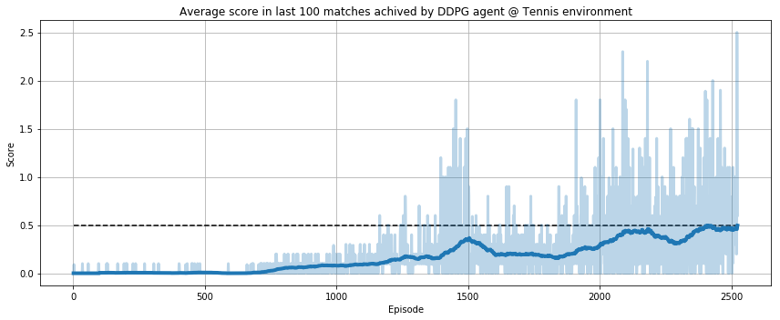
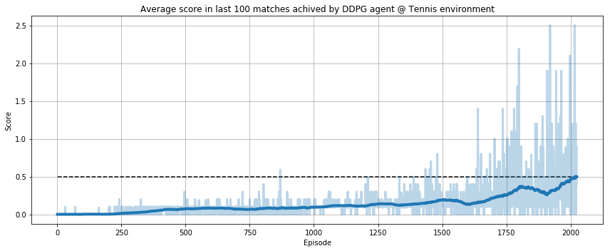

# Report

## Learning Algorithm

As it is described in the following sections, I have tried 2 different approaches, a single **DDPG** (the simplest one) and **MADDPG (with better results)**.
The **model is detailed in this section**:

### First approach: Single Deep Deterministic Policy Gradient (DDPG)

First of all, I tried the **DDPG architecture** from the last challenge (available in the *drl_reacher* repository).

The architecture is the same that I used in *the reacher* challenge, as is. The actor maps the 24 inputs to 256, then to 128 and finally to 2 outputs using ReLU as activation functions with the exception of the last layer that has a tanh because actions are bounded between -1 and 1.

And the critic network takes the 24 input applies batch normalization and concatenates the output to the actions predicted by the actor. Then these values are mapped to 256, then to 128 and finally to 1 (the Q-value). Once more, ReLU has been selected as activation function with the exception of the last layer where a linear activation function has been used (to allow negative values).

In this case, for each time step I insert 2 samples into the replay buffer (one for the left player and another one for the right player). Both players share the actor and the critic: they apply the same policy.

Using this approach 6 out of 10 times the learned policy reaches the goal before 10k episodes.

It reaches the goal, but not always. After 10 trials, the minimum number of episodes to meet the goal was 2523.

This implementation can be found in `DDPG` folder (agent module and ipynb).

### Multi Agent Deep Deterministic Policy Gradient (MADDPG)

In this case, both agents share the actor (because same samples are useful for both players) and an omniscient critic. But this time the critic not only receives the state and action from current agent, it also has the state and action of the other agent.

The other implementation detail needed is to change the buffer tuples from `(state, action, reward, next_state, done)` to `(state, action, reward, next_state, done, state_other, action_other, next_state_other)`.
Where *other* is the opponent.

These changes meant an improvement in the agent's stability.

### Hyperparameters

Both optimizers start with a 1e-3 learning rate using soft updates to the target network with tau 1e-3. With mini batches of 1024 samples.

The discount factor used to update the critic network is .99.

Finally, the size of the replay buffer is 1e6.

## Plot of Rewards

The goal is to receive an average reward of +0.5 (over 100 consecutive episodes, after taking the maximum over both agents).

While the naive DDPG agent not always reached the goal (doing some ups and downs). The MADDPG met the goal 10/10 times like in the following runs:

The agent reached the goal around episode 2100.

Both models (actor and critic) have been checkpointed to `actor_weights.pth` and `critic_weights.pth`.

## Future Work

First, a richer state representation with more information like pixels could help to learn better policies.
Besides, use Prioritized Experience Replay may improve the learning.
Finally, try another algorithms like Multi Agent Proximal Policy Optimization (MAPPO) could be interesting.